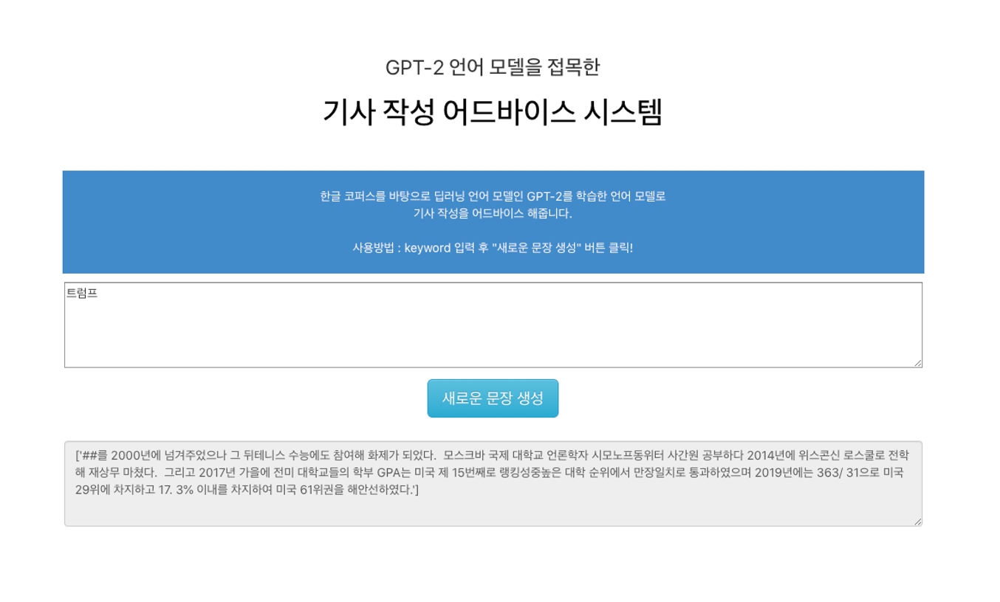

# Django-proj
GPT-2 언어모델을 접목한 기사 작성 어드바이스 시스템

<모델 변경시>

모델 위치:blog/system/

Release의 model-139000.data-00000-of-00001, blog/system/pretrained/test에 붙여넣기

<환경구축방법>

환경구축 모든과정은 The-System-for-Article-writing-advice-based-on-GPT2-language-model/ 위치 (readme와 동일한 위치) 에서 수행.

1)Venv 가상환경 구축

window > C:\Python35\python -m venv myvenv

mac$ python3 -m venv myvenv

가상환경 activate

Window > myvenv\Scripts\activate

Mac$ source myvenv/bin/activate

2)모델을 위한 환경구축

Pip install numpy

pip install tensorflow==1.14

3)장고설치

pip update

(myvenv) ~$ python3 -m pip install --upgrade pip

install

(myvenv) ~$ pip install django~=2.0.0

4)데이터베이스 모델추가

Migration 파일 만들기

(myvenv) ~/djangogirls$ python manage.py makemigrations blog

데이터베이스에 모델추가 반영

python manage.py migrate blog

User Registration with error: no such table: auth_user에러 발생시

python manage.py migrate

5)admin계정 생성

python manage.py createsuperuser

6)실행

python manage.py runserver

http://127.0.0.1:8000/

admin 페이지http://127.0.0.1:8000/admin/ 

admin페이지에서 Blog>posts 들어가면 Post object형태로 저장되어있음. 클릭 시 내용 확인 가능.(input, output, 수행 시각)
